# HTTP-Protokolle

Diese Einheit behandelt die Grundlagen und Weiterentwicklungen des HTTP-Protokolls sowie moderne Mechanismen für Echtzeit-Datenübertragung. Jede Sektion enthält einen kurzen einleitenden Text und weiterführende Bullet-Points.

---

## 1. Einführung in HTTP

HTTP steht für „Hypertext Transfer Protocol“ und ist ein Protokoll der Anwendungsschicht, das den Datenaustausch im World Wide Web regelt.  
Es arbeitet nach dem Client-Server-Modell, bei dem ein Client (z. B. ein Webbrowser) Anfragen (Requests) an einen Webserver sendet und Antworten (Responses) empfängt.  
HTTP ist grundsätzlich zustandslos, das heißt, jeder Request wird unabhängig vom vorherigen behandelt, was Skalierbarkeit und Caching erleichtert.  
In Version HTTP/1.1 (standardisiert in RFC 2616) werden persistente Verbindungen mit Keep-Alive eingeführt, um die Performance durch Mehrfachnutzung einer TCP-Verbindung zu verbessern.  
HTTP/2 (RFC 7540) optimiert den Datentransport durch Multiplexing und Header-Kompression (HPACK), wodurch Latenz und Overhead reduziert werden.  
HTTP/3 überträgt HTTP-Semantik über das QUIC-Protokoll auf UDP, integriert TLS 1.3 und löst das Head-of-Line-Blocking-Problem auf Transportschicht-Ebene.  
Die Kommunikation über HTTP erfolgt typischerweise im Klartext auf Port 80, während HTTPS (die sichere Variante) TLS-Verschlüsselung auf Port 443 nutzt.  
HTTP-Statuscodes (z. B. 200 für Erfolg, 404 für „Nicht gefunden“ und 500 für Serverfehler) informieren den Client über das Ergebnis der Anfrage und steuern das Verhalten im Web.  


### Timeline
- **1991** – Erste Version HTTP/0.9: sehr einfaches Ein-Zeilen-Protokoll, eingesetzt im ersten WorldWideWeb-System am CERN
- **Mai 1996** – RFC 1945 veröffentlicht: Standardisierung von HTTP/1.0 mit Definition grundlegender Methoden und Header
- **Januar 1997** – RFC 2068 veröffentlicht: Einführung von HTTP/1.1 mit persistente Verbindungen und Chunked Transfer Encoding
- **Juni 1999** – RFC 2616 veröffentlicht: Überarbeitung und Konsolidierung von HTTP/1.1, inkl. Caching-Verhalten und Statuscodes
- **Mai 2015** – RFC 7540 veröffentlicht: HTTP/2 führt Multiplexing, HPACK-Header-Kompression und Server Push ein
- **6. Juni 2022** – RFC 9114 veröffentlicht: HTTP/3 über QUIC mit integriertem TLS 1.3 und Vermeidung von Head-of-Line Blocking

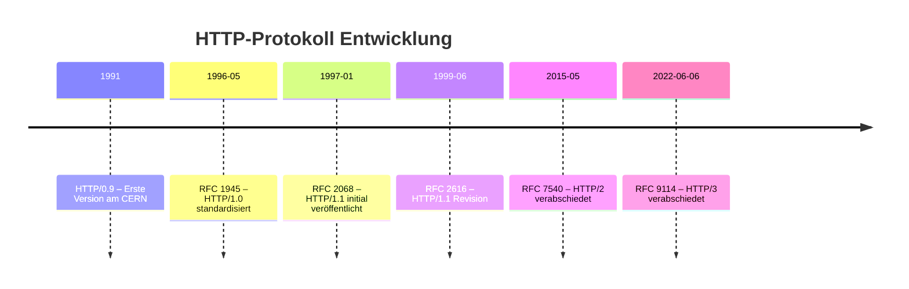

### Stateless-Design: Jeder Request unabhängig
Stateless Design bedeutet, dass jeder Client-Request unabhängig verarbeitet wird, ohne dass der Server Kontext aus vorherigen Interaktionen speichert.  
Der Client muss dabei sämtliche Zustandsinformationen (z. B. Authentifizierungs-Token oder Session-Daten) mit jeder Anfrage mitsenden, was die Serverimplementierung vereinfacht und horizontale Skalierung erleichtert.  
Dadurch entfallen auf Serverseite Aufwand für Sitzungsverwaltung und Fehlererholung, allerdings kann der erhöhte Overhead an wiederholten Daten die Netzwerklast steigern und erfordert gegebenenfalls externe State-Management-Lösungen.  
In RESTful-APIs ist Statelessness ein zentrales Prinzip, da es lose Kopplung, einfache Lastverteilung und höhere Ausfallsicherheit fördert.  

### Hauptbestandteile: URL, Methode (GET, POST, ...), Statuscodes
#### URLs  
Ein Uniform Resource Locator (URL) ist die standardisierte Adresse einer Ressource im Web und setzt sich aus mehreren Teilen zusammen: dem Schema (z. B. `http` oder `https`), der Autorität (Host und optionalem Port), dem Pfad, einer optionalen Query-Zeichenkette und einem Fragment.  
Beispiel: `https://example.com:443/path/to/page?search=term#section` – hier gibt `https` das Protokoll an, `example.com` den Server, `443` den Port, `/path/to/page` den Pfad, `search=term` Parameter, und `#section` einen Sprunganker.  
URLs ermöglichen Clients die gezielte Anforderung von HTML-Dokumenten, Bildern oder API-Endpunkten und bilden damit die Grundlage jeder HTTP-Anfrage.

#### HTTP-Methoden  
HTTP-Methoden (oder „Verben“) geben an, welche Aktion ein Client auf einer Ressource ausführen möchte.  
- **GET**: Ruft eine Ressource ab, sicher und cachebar, ohne Seiteneffekte.  
- **POST**: Sendet Daten an den Server, um eine neue Ressource zu erzeugen oder einen Prozess auszulösen.  
- **PUT** und **PATCH**: Ersetzen (`PUT`) oder ändern (`PATCH`) eine Ressource vollständig oder partiell.  
- **DELETE**: Entfernt eine Ressource.  
- **HEAD** und **OPTIONS**: Fragt Meta-Informationen ab, ohne den Ressourcenkörper zu übertragen.  
Einige Methoden gelten als _idempotent_ (mehrmalige Ausführung führt zum gleichen Ergebnis) oder _cacheable_, was Einfluss auf Performance und Skalierung hat.

#### HTTP-Statuscodes  
Statuscodes sind drei­stellige Zahlen in der Server-Antwort, die das Ergebnis der Anfrage klassifizieren:  
- **1xx Informational**: Hinweis, dass die Anfrage empfangen wurde und weiter bearbeitet wird.  
- **2xx Success**: Aktion erfolgreich (z. B. **200 OK**).  
- **3xx Redirection**: Client muss weitere Schritte durchführen (z. B. **301 Moved Permanently**).  
- **4xx Client Error**: Fehler auf Client-Seite (z. B. **404 Not Found**, **400 Bad Request**).  
- **5xx Server Error**: Fehler auf Server-Seite (z. B. **500 Internal Server Error**, **503 Service Unavailable**).  
Clients können anhand der Statuscode-Klasse ihr Verhalten steuern, etwa durch erneutes Senden, Caching oder Umlenkung auf eine andere URL.  


## Skalierbarkeit und Caching

- **Stateless-Architektur**  
  Jeder Request wird unabhängig verarbeitet, was einfache Lastverteilung und horizontale Skalierung hinter Load Balancern ermöglicht.  
  *Beispiel*: Ein Nginx-Load-Balancer verteilt eingehende Anfragen an drei identische Webserver, ohne dass Informationen über vorherige Interaktionen zwischen den Servern ausgetauscht werden müssen.

- **Persistente Verbindungen (Keep-Alive)**  
  Mehrere Requests nutzen dieselbe TCP-Verbindung, reduzieren Handshake-Overhead und verbessern den Gesamtdurchsatz.  
  *Beispiel*: Beim Laden einer Webseite sendet der Browser das HTML, mehrere CSS- und JavaScript-Dateien sowie Bilder über eine einzige TCP-Verbindung, statt für jedes Asset eine neue Verbindung aufzubauen.

- **Cache-Mechanismen**  
  `Cache-Control`, `ETag` und `Last-Modified` erlauben Browsern und Proxies, Ressourcen lokal zu speichern und unnötige Anfragen zum Ursprungsserver zu vermeiden.  
  *Beispiel*: Wird für ein Logo der Header `Cache-Control: max-age=86400` gesetzt, lädt der Browser das Logo bis zu 24 Stunden lang nicht erneut herunter.

- **Bedingte Anfragen (Conditional Requests)**  
  Mit `If-Modified-Since` oder `If-None-Match` fragt der Client beim Server nach, ob sich eine Ressource geändert hat, und erhält bei unverändertem Inhalt einen `304 Not Modified`.  
  *Beispiel*: Ein API-Client übermittelt `If-None-Match: "v2.1"`, der Server erkennt keinen Versionswechsel und antwortet nur mit dem Statuscode, statt den kompletten Payload erneut zu senden.

- **Proxy- und CDN-Caching**  
  Zwischenspeicherung auf Netzwerk-Edge oder in Rechenzentren entlastet den Origin-Server und verkürzt die Latenz für Endnutzer.  
  *Beispiel*: Ein CDN wie Cloudflare speichert häufig angeforderte Assets (z. B. CSS-Dateien) auf Knoten weltweit, sodass Nutzer die Datei vom geografisch nächstgelegenen Server erhalten.

## Microservice-Architekturen

In verteilten Systemen dienen Microservices der Entkopplung einzelner Fachbereiche; HTTP stellt hier die lingua franca für den Austausch dar:

- **Leichtgewichtige Kommunikationsschnittstelle**  
  Jeder Service exponiert klar definierte HTTP-Endpoints (REST/JSON oder gRPC-über-HTTP/2), wodurch Teams unabhängig deployen können.

- **Lose Kopplung durch URL-Versionierung**  
  Versionierte API-Pfade (z. B. `/v1/users`, `/v2/orders`) ermöglichen Weiterentwicklungen ohne Bruch bestehender Clients.

- **Statuscodes und Fehler-Handling**  
  Typische HTTP-Statuscodes (4xx/5xx) signalisieren Service-Fehler oder Validierungsprobleme direkt im Protokoll, was Retries, Circuit Breaker und Monitoring erleichtert.

- **API-Gateway als zentraler Router**  
  Ein vorgeschalteter HTTP-Proxy (z. B. Kong, Ambassador) bündelt Routen, Authentifizierung, Rate-Limiting und Monitoring für alle Services.

- **Service Discovery und Load Balancing**  
  HTTP-Clients lösen dynamisch Service-URLs über einen Registry-Mechanismus (z. B. DNS-basierte Einträge oder Konsul), um Lastverteilung und Ausfallsicherheit zu realisieren.

- **Tracing und Observability**  
  HTTP-Header (z. B. `X-Request-ID`) transportieren Korrelationstokens, sodass verteilte Traces in Tools wie Jaeger oder Zipkin die gesamte Request-Kette nachzeichnen.

- **Sicherheit durch TLS und Auth-Layer**  
  Man schützt interne Service-Calls per mTLS oder zentraler Authentifizierungs-API, während Endkunden-APIs via OAuth2/JWT über HTTPS abgesichert werden.

- **Evolution durch HTTP/2 & HTTP/3**  
  Multiplexing und verbesserte Latenz moderner Protokollversionen steigern Performance und Ressourceneffizienz in stark verteilten Umgebungen.

---

## 2. HTTP/1.1: Merkmale und Limitierungen

HTTP/1.1 wurde 1997 offiziell eingeführt, um die gravierenden Performance-Schwächen von HTTP/1.0 zu beheben und das damals rapide wachsende Web effizienter zu gestalten. Über Unternehmen und Forschungseinrichtungen hinaus stieg der Bedarf nach schnellerer Übertragung, geringerer Latenz und besserem Umgang mit dynamischen Inhalten. HTTP/1.1 führte deshalb mehrere bedeutende Neuerungen ein, brachte aber selbst Engpässe mit, die im Laufe der Zeit zu weiteren Protokoll-Revisionen führten.

### Persistente Verbindungen mit Keep-Alive

Bis HTTP/1.0 verursachte jede Ressource einen eigenen TCP-Handshake, was bei modernen Webseiten mit dutzenden Bildern, Skripten und Stylesheets zu enormem Overhead führte. HTTP/1.1 löst das durch **persistente Verbindungen**, auch Keep-Alive genannt:

- **Funktionsweise**: Client und Server eröffnen einmalig eine TCP-Verbindung („3-Wege-Handshake“, siehe Diagramm unten) und halten sie für mehrere Requests offen.  
- **Vorteil**: Wegfall wiederholter Handshakes spart bis zu 500 ms pro Verbindungsaufbau und reduziert CPU- und Netzwerk-Last.  
- **Konfiguration**: In Apache aktiviert man dies mit `KeepAlive On` und steuert über `MaxKeepAliveRequests` und `KeepAliveTimeout` die Anzahl und Dauer offener Verbindungen.  
- **Praktisches Beispiel**: Eine Webseite mit 20 Bildern lädt beim aktivierten Keep-Alive alle Assets über eine Verbindung, statt 21 Verbindungen aufzubauen. Das senkt die Ladezeit auf Mobilfunknetzen deutlich.

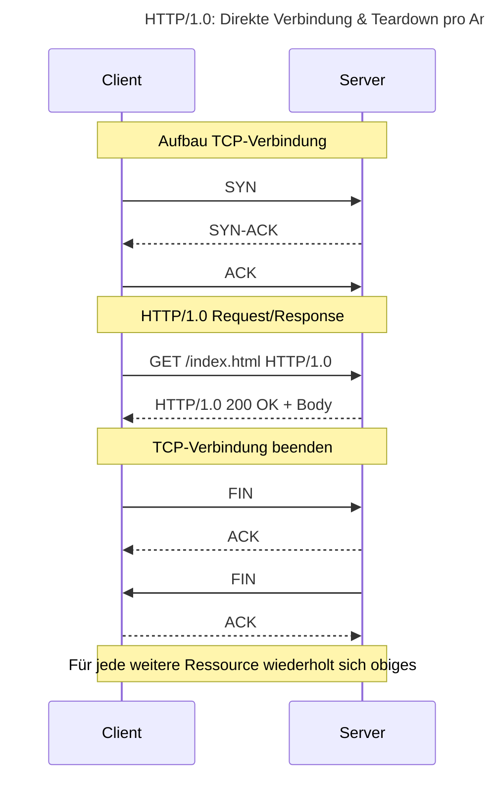

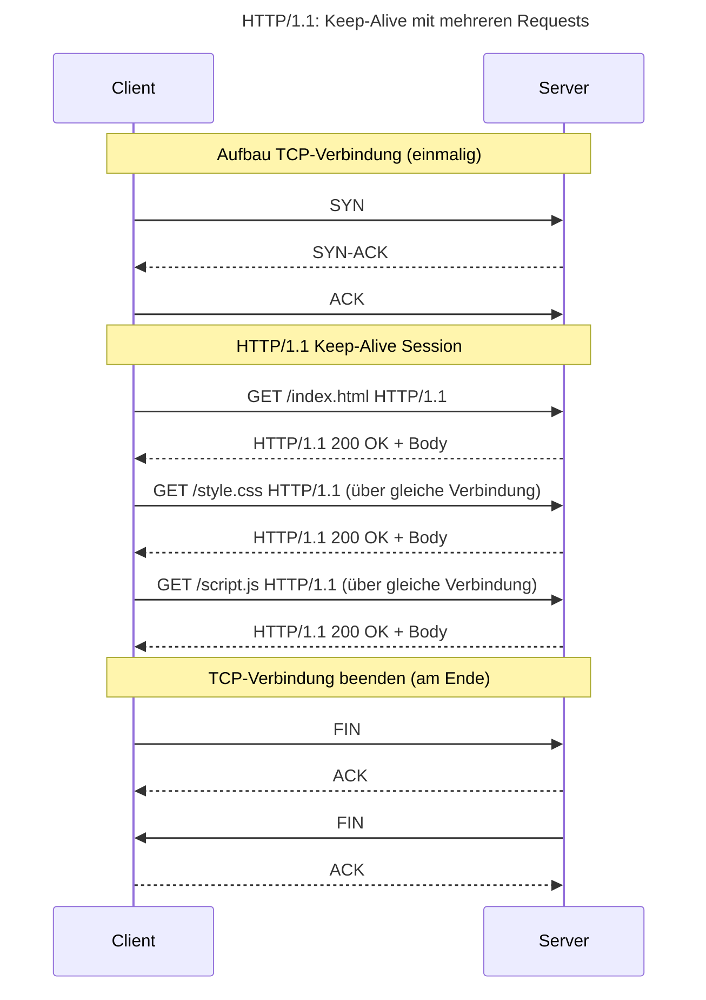

## Beispielhafte Latenz-Berechnung

Angenommen, die Round-Trip Time (RTT) zwischen Client und Server beträgt jeweils 100 ms und der TCP-Teardown erfordert ebenfalls etwa 1 RTT.

### HTTP/1.0 (pro Ressource):
1. **TCP-Handshake**: 1 RTT → 100 ms  
2. **HTTP Request + Response**: 1 RTT → 100 ms  
3. **TCP-Teardown**: 1 RTT → 100 ms  
   
**Summe je Anfrage**: 3 RTT = 300 ms  
Für 3 Ressourcen: 3 × 300 ms = **900 ms**

### HTTP/1.1 Keep-Alive (3 Ressourcen über eine Verbindung):
1. **TCP-Handshake**: 1 RTT → 100 ms  
2. **3 × HTTP Request + Response**: 3 RTT → 300 ms  
3. **TCP-Teardown**: 1 RTT → 100 ms  
   
**Gesamtlatenz**: 5 RTT = **500 ms**

---

**Ersparnis durch Keep-Alive**:  
900 ms (HTTP/1.0) − 500 ms (HTTP/1.1) = **400 ms** weniger Latenz bei 3 Ressourcen.


### Pipelining von Requests

Ein weiteres Feature ist **Pipelining**, das auf persistente Verbindungen aufsetzt:

- **Ziel**: Mehrere HTTP-Requests in einer einzigen TCP-Paketfolge senden, ohne auf vorherige Responses zu warten.  
- **Funktionsweise**: Browser verschicken mehrere GET-Requests hintereinander und erwarten dann sequentiell Antworten.  
- **Limitierung**: Sehr eingeschränkte Browser-Unterstützung (Chrome, Firefox deaktivierten Piplining aus Kompatibilitätsgründen).  
- **Praktisches Beispiel**: Würde ein Browser 5 CSS-Dateien pipelining-fähig anfragen, ginge der Overhead in der Theorie gegen Null. In der Praxis bleibt der Vorteil oft ungenutzt, weil Browser Pipelining aus Sicherheits- und Kompatibilitätsgründen deaktiviert haben.

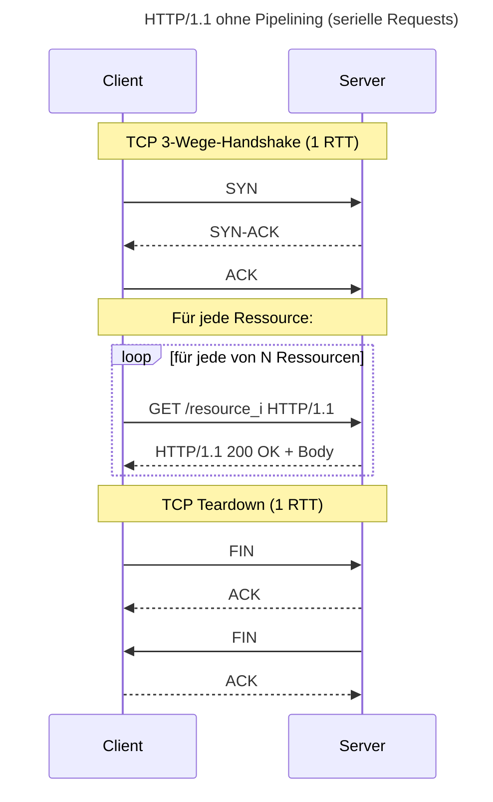

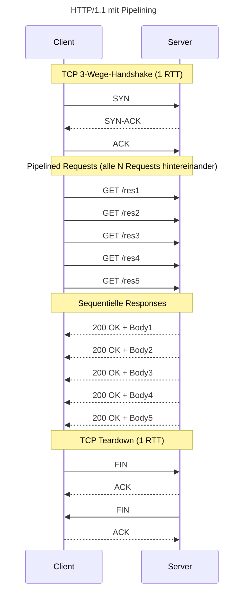
#### Beispielhafte Latenz-Berechnung (RTT = 100 ms, N = 5 Ressourcen)

##### Ohne Pipelining (HTTP/1.1 serielle Requests)
1. **TCP-Handshake**: 1 RTT = 100 ms  
2. **N × Request/Response**: N × 1 RTT = 5 × 100 ms = 500 ms  
3. **TCP-Teardown**: 1 RTT = 100 ms  

**Gesamt**: (1 + 5 + 1) RTT = 7 RTT = **700 ms**

---

##### Mit Pipelining
1. **TCP-Handshake**: 1 RTT = 100 ms  
2. **Pipelined Requests & sequentielle Responses**:  
   - Requests gesendet unmittelbar nach Handshake (Overlap, vernachlässigbar)  
   - Erste Response: 1 RTT = 100 ms  
   - Weitere Responses “fließen” innerhalb desselben Antwortfensters (keine zusätzlichen RTTs)  
3. **TCP-Teardown**: 1 RTT = 100 ms  

**Gesamt**: (1 + 1 + 1) RTT = 3 RTT = **300 ms**

---

##### Ersparnis durch Pipelining
700 ms − 300 ms = **400 ms** weniger Latenz bei 5 Ressourcen.  


### Head-of-Line Blocking bei serieller Bearbeitung

Das Pipelining-Design birgt das Problem des **Head-of-Line Blocking**:
Head‐of‐Line Blocking (HOLB) bezeichnet das Phänomen, dass in HTTP/1.1-Pipelining alle nachfolgenden Antworten warten müssen, bis die erste vollständig übertragen ist. Obwohl mehrere Requests gleichzeitig gesendet werden, sorgt das FIFO-Verfahren dafür, dass langsame oder fehlende Antworten am Anfang der Pipeline sämtliche folgenden blockieren. 

- **Erklärung**: Wenn eine Antwort auf Request 1 ausfällt oder verzögert ist, werden alle nachfolgenden Responses blockiert, obwohl deren Daten bereits bereitstehen.  
- **Konsequenz**: Single-Connection-Pipelining kann bei langsamen Ressourcen oder Netzwerkproblemen sogar langsamer sein als einfache sequentielle Anfragen.  
- **Praktisches Beispiel**: Eine große Video-Datei als Response 1 verzögert die Auslieferung von kleinen CSS-Dateien, die an zweiter Stelle im Pipeline-Request stehen, was das Seiten-Rendering verzögert.


## Sequence-Diagramm mit Head-of-Line Blocking

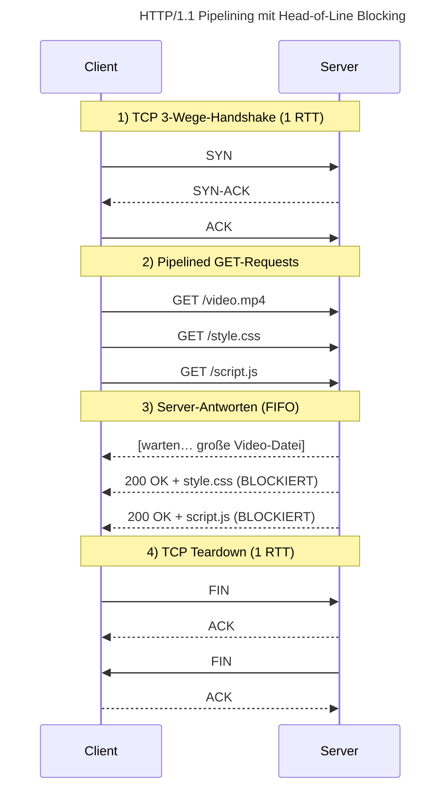

## Timing-Chart (N = 3 Ressourcen)

| Phase                   | Dauer      | Beginn   | Ende      |
|-------------------------|------------|----------|-----------|
| TCP-Handshake           | 1 RTT=100ms| t₀=0ms   | t₁=100ms  |
| Video-Response (R₁)     | T₁=300ms   | t₁=100ms | t₂=400ms  |
| style.css & script.js   | BLOCKIERT  | t₂=400ms | t₂=400ms  |
| style.css-Transfer (R₂) | T₂=50ms    | t₂=400ms | t₃=450ms  |
| script.js-Transfer (R₃) | T₃=50ms    | t₃=450ms | t₄=500ms  |
| TCP-Teardown            | 1 RTT=100ms| t₄=500ms | t₅=600ms  |

## Beispielhafte Latenz-Berechnung

* **Annahmen**:

  * Round‐Trip Time (RTT) = 100 ms
  * Transferzeiten: Video T₁=300 ms, CSS T₂=50 ms, JS T₃=50 ms

* **Gesamtzeit HTTP/1.1 Pipelining mit HOLB**:

  * 1 RTT (Handshake) + T₁ + T₂ + T₃ + 1 RTT (Teardown)
  * \= 100 ms + 300 ms + 50 ms + 50 ms + 100 ms
  * \= **600 ms**

* **Ideal (ohne HOLB)** – z. B. mit Multiplexing (HTTP/2):

  * 1 RTT (Handshake) + max(T₁, T₂, T₃) + 1 RTT
  * \= 100 ms + 300 ms + 100 ms
  * \= **500 ms**

→ **Head-of-Line Blocking kostet hier 100 ms zusätzlich**, da schnelle Ressourcen nicht vor dem langsamen ersten Transfer ausgeliefert werden können.


### Chunked Transfer Encoding

HTTP/1.1 führte Chunked Transfer Encoding ein, um Inhalte zu übertragen, deren Größe vorab nicht bekannt ist oder dynamisch erzeugt wird. Dieser Mechanismus teilt den Response-Body in mehrere Teile (Chunks) auf.

- **Funktionsweise**: Der Server sendet den Body in Teilarbeiten („Chunks“), jeweils mit ihrer Länge im Header, und markiert das Ende mit einem Null-Chunk.  
- **Vorteil**: Der Client kann anfangen zu rendern, bevor der gesamte Inhalt generiert ist. Ideal bei Streaming oder Live-Updates.  
- **Praktisches Beispiel**: Ein Chat-Dienst überträgt Nachrichten fortlaufend, ohne die Content-Length vorab berechnen zu müssen. Jeder Chunk enthält eine neue Nachricht, die sofort im Browser angezeigt wird.


#### 1. Aufbau eines Chunks

Jeder Chunk besteht aus zwei Teilen:

* **Längenfeld**: Hexadezimale Zahl gefolgt von CRLF (z. B. `1A3F\r\n` für 6719 Bytes)
* **Datenblock**: Genau so viele Bytes, wie im Längenfeld angegeben, gefolgt von CRLF

```
1A3F
<6719 Bytes Daten>
```

#### 2. Signal zur Beendigung

Am Ende der Datenübertragung sendet der Server einen Null-Chunk `0\r\n`, gefolgt von optionalen Trailer-Headern und einem finalen CRLF:

```
0

```

Dadurch erkennt der Client, dass keine weiteren Daten folgen.

#### 3. Ablauf im HTTP-Response

1. Statuszeile und Header (ohne `Content-Length`), dafür `Transfer-Encoding: chunked`
2. Erster Chunk: Länge + Daten
3. Zweiter Chunk: Länge + Daten
4. … weitere Chunks …
5. Null-Chunk + Abschluss-CRLF

```http
HTTP/1.1 200 OK
Transfer-Encoding: chunked
Content-Type: text/html; charset=UTF-8

3E8
<html>… erste 1000 Zeichen …</html>
4D2
<html>… nächste 1234 Zeichen …</html>
0


```

#### 4. Vorteile

* **Frühes Rendering**: Browser und Clients können mit dem Darstellen beginnen, sobald der erste Chunk empfangen ist.
* **Streaming & Live-Updates**: Ideal für serverseitiges Streaming von Daten (Videos, Logs, Chat-Nachrichten).
* **Keine Content-Length-Vorabinfo**: Entfall der Notwendigkeit, die gesamte Datenlänge vorab zu berechnen.

#### 5. Praktische Beispiele

* **Chat-Anwendung**: Jeder neue Chat-Beitrag wird als eigener Chunk gesendet, sobald er eingeht, sodass Nutzer sofort Updates sehen.
* **Server-Sent Events (SSE)**: Ereignisse werden nacheinander als Chunks übertragen, um kontinuierliche Updates zu liefern.
* **Live-Logging**: Ein gehosteter Service sendet seine Log-Zeilen direkt zum Client, ohne sie zuerst in eine Datei zu schreiben.

---

#### 6. Implementierungshinweise

* In vielen Webframeworks (z. B. Node.js, Python Flask) aktivieren sich Chunks automatisch, wenn `Content-Length` nicht gesetzt wird und Streaming-APIs verwendet werden.
* Manche Reverse-Proxies oder Load-Balancer müssen explizit für Chunked Encoding konfiguriert werden, um Chunks korrekt weiterzuleiten.
* Troubleshooting: Fehlt CRLF oder hat falsches Längenfeld, kann der Client den Stream nicht parsen und bricht ab.

---

#### 7. Zu beachtende Fallstricke

* **Proxy-Kompatibilität**: Einige legacy Proxies unterstützen Chunked Encoding nicht vollständig.
* **Trailer-Header**: Werden selten genutzt, aber erlauben nachträgliche Header-Infos (z. B. Checksums).
* **Fehlerbehandlung**: Fehler während des Streams sollten durch einen abbrechenden Chunk (z. B. `0\r\n`) und passenden Statuscode signalisiert werden.


#### Caching-Header und ihre Bedeutung

Caching ist zentral, um Bandbreite und Serverlast zu reduzieren. HTTP/1.1 standardisierte dafür mehrere Header:

- **Cache-Control**: Über `max-age`, `no-cache`, `must-revalidate` usw. steuert der Server, wie lange und unter welchen Bedingungen ein Proxy oder Browser eine Ressource zwischen­speichern darf.  
  - *Beispiel*: `Cache-Control: public, max-age=86400` erlaubt allen Caches, das Asset für 24 Stunden zu halten.  
- **ETag**: Eine eindeutige Kennung (z. B. Hash des Inhalts), die bei jeder Änderung neu generiert wird. Clients senden `If-None-Match` im Request, um nur bei geändertem Inhalt den Body zu erhalten, sonst einen `304 Not Modified`.  
  - *Beispiel*: Das Stylesheet `/main.css` bekommt `ETag: "abc123"`. Browser schickt `If-None-Match: "abc123"` und spart sich den kompletten Download, wenn keine Änderung vorliegt.  
- **Last-Modified**: Gibt das Änderungsdatum der Ressource an und erlaubt über `If-Modified-Since`, nur bei neuerem Datum den Body anzufordern.  
  - *Beispiel*: Images von Logos ändern sich selten. Mit `Last-Modified: Wed, 01 Jul 2020 12:00:00 GMT` müssen Browser erst prüfen, bevor sie das Bild laden.

### Zusammenspiel und Performance-Trade-offs

HTTP/1.1 verbesserte die Effizienz erheblich im Vergleich zu HTTP/1.0, aber die Kombination der beschriebenen Mechanismen führt zu komplexen Trade-offs:

1. **Keep-Alive vs. Ressourcenverbrauch**  
   - Längere Timeouts halten Verbindungen offen und verbrauchen Server-Ressourcen. Ein zu niedriges `KeepAliveTimeout` zerstört Vorteile, ein zu hohes führt zu zu vielen offenen Sockets.  
2. **Pipelining vs. Blockierung**  
   - Wer auf Pipelining setzt, riskiert Head-of-Line Blocking. Viele Browser setzen stattdessen auf „Connection per Request“ oder HTTP/2-Multiplexing, um das Problem zu umgehen.  
3. **Chunked Encoding vs. Proxy-Kompatibilität**  
   - Nicht alle Zwischen-Proxies verstehen Chunked-Transfer korrekt, was zu fehlerhaften oder abgebrochenen Streams führen kann.  
4. **Caching vs. Konsistenz**  
   - Aggressives Caching spart Bandbreite, kann aber veraltete Ressourcen liefern, wenn ETag- oder Last-Modified-Checks unterbleiben.

Die Limitierungen von HTTP/1.1 – besonders Head-of-Line Blocking und ineffiziente Pipelining-Unterstützung – führten zur Entwicklung von HTTP/2 und HTTP/3. Diese Protokolle basieren auf Multiplexing und moderner Verschlüsselung und lösen die Engpässe von HTTP/1.1, ohne auf dessen bewährte Mechanismen zu verzichten.


---

## 3. HTTP/2 & HTTP/3 (QUIC)

Die Weiterentwicklungen HTTP/2 und HTTP/3 steigern Effizienz und Sicherheit durch fortschrittliche Übertragungsmechanismen.

* **HTTP/2**:

  * Multiplexing von Streams über eine Verbindung
  * HPACK Header-Kompression zur Reduktion der Overheads
  * Server Push für proaktives Ressourcen-Laden

* **HTTP/3 (QUIC)**:

  * Aufbau auf UDP statt TCP für geringere Latenz
  * Integriertes TLS 1.3 für schnelleren Handshake
  * Vermeidung von Head-of-Line Blocking auf Transportschicht
  * Unterstützung in modernen Browsern und Servern
  * Auswirkungen auf CDN- und Cloud-Infrastrukturen


### HTTP/2

HTTP/2 (RFC 7540) bringt drei große Neuerungen: Multiplexing, Header-Kompression und Server Push.

#### 3.1 Multiplexing von Streams

* **Problem in HTTP/1.x**: Jede Ressource benötigt eigene Verbindung oder leidet unter Head-of-Line Blocking.
* **Lösung**: Multiplexing erlaubt parallele Streams über eine einzige TCP-Verbindung.

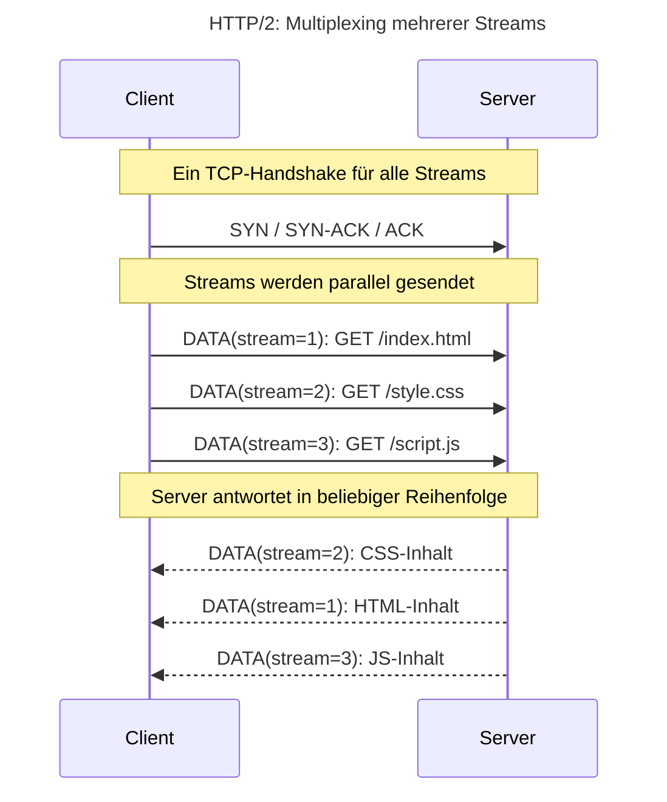

#### 3.2 HPACK Header-Kompression

* **Unkomprimierte Header** in HTTP/1.x verursachen hohen Overhead, da bei jedem Request vollständige Header gesendet werden.
* **HPACK** nutzt eine dynamische Tabelle und Huffman-Codierung, um wiederkehrende Header-Felder compact zu übertragen.

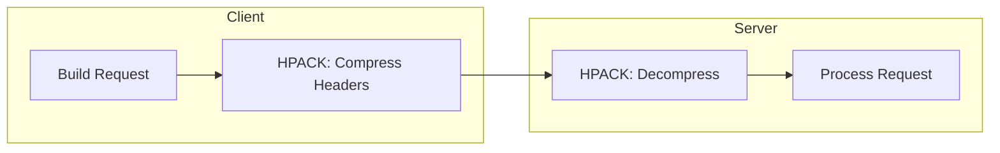

#### 3.3 Server Push

* **Ziel**: Proaktives Senden von abhängigen Ressourcen ohne explizite Client-Anfrage.
* **Beispiel**: Beim Abrufen von `/index.html` kann der Server zusätzlich `/style.css` und `/script.js` pushen.

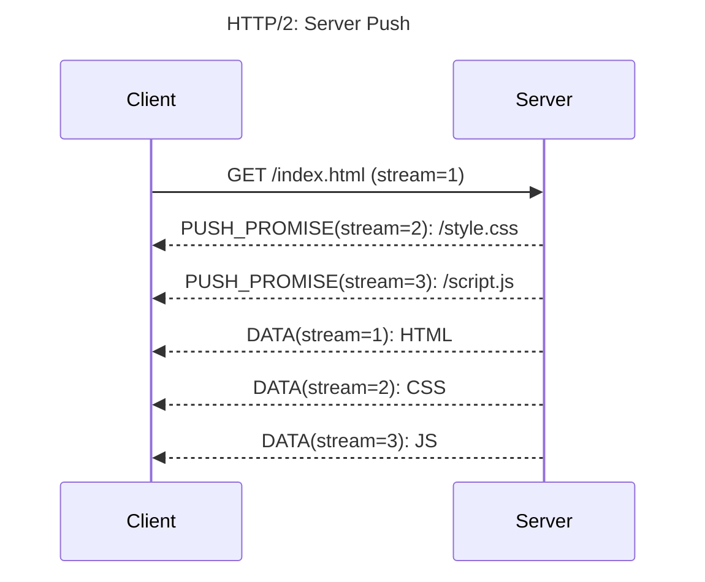

---

### HTTP/3 (QUIC)

HTTP/3 (RFC 9114) verlagert die Transport-Schicht auf QUIC (über UDP) und integriert TLS 1.3 direkt im Protokoll.

#### 3.4 QUIC-Handschlag und integriertes TLS 1.3

* **Weniger RTTs**: QUIC verbindet UDP-3-Wege-Handschlag und TLS-Handshake in einer Sequenz.
* **0-RTT**: Wiederkehrende Clients können frühzeitige Daten senden.

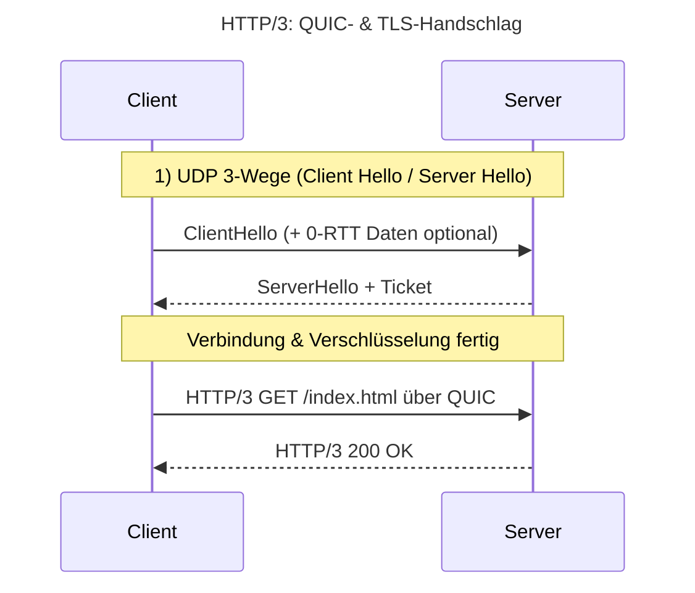

#### 3.5 Vermeidung von Head-of-Line Blocking

* **Bei TCP** blockiert ein verlorenes Paket alle Streams.
* **QUIC** nutzt eigene Sequenznummern pro Stream: Paketverlust in einem Stream blockiert nicht andere.

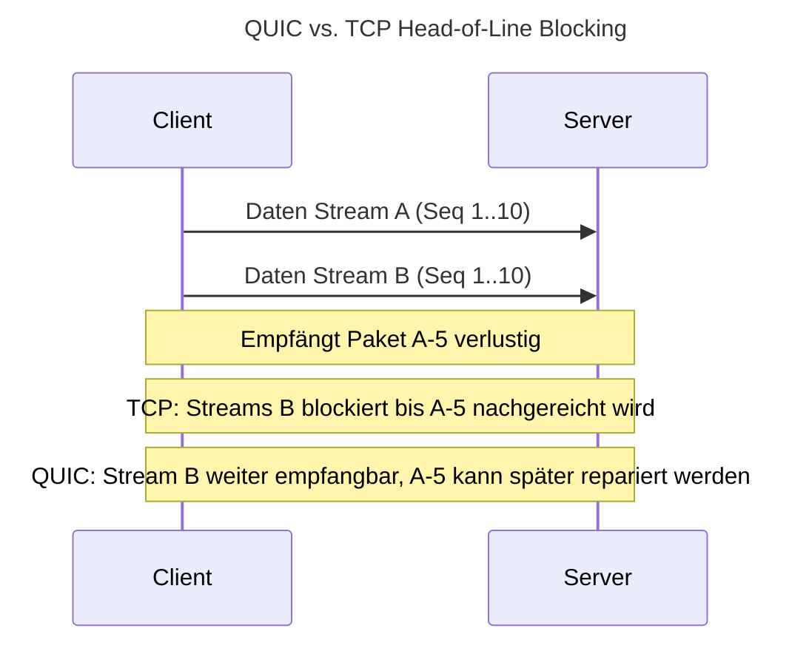

---

### 3.6 Unterstützung & Ökosystem

* **Browser-Support**: HTTP/2 in allen modernen Browsern, HTTP/3 in Chrome, Firefox und Edge aktiviert.
* **Server-Implementierungen**: Nginx, Apache mit Modulen, Caddy, Cloud-Provider-Edge.
* **CDN-Impact**: CDNs wie Cloudflare und Fastly setzen HTTP/3 ein, um weltweit niedrigste Latenzen zu erzielen.
* **Migration**: Aktivierung in Webserver-Konfiguration oft via `listen 443 ssl http2` (Nginx) und `Protocols h2 h3` (QUIC).

---

Diese Erweiterungen sorgen für deutlich bessere Ausnutzung moderner Netzwerke, reduzieren Latenzen und beseitigen Engpässe, die HTTP/1.1 in die Jahre kommen ließen.

---

## 4 WebSockets & Server-Sent Events

Live-Kommunikation erfordert dauerhafte Verbindungen oder Server-initiierte Updates – WebSockets und SSE bieten hierfür unterschiedliche Ansätze.

### 4.1 WebSockets: Voll-duplex-Kommunikation

WebSockets ermöglichen eine bidirektionale, dauerhafte Verbindung zwischen Client und Server über TCP.

* **Upgrade-Handshake**: Startet als HTTP/1.1-Request mit `Upgrade: websocket`, wechselt dann zu einem WebSocket-Protokoll.
* **Datenrahmen**: Nachrichten werden in Frames verpackt (Text oder Binär).
* **Anwendungsfälle**: Chat-Applikationen, Multiplayer-Games, IoT-Telemetrie, interaktive Dashboards.

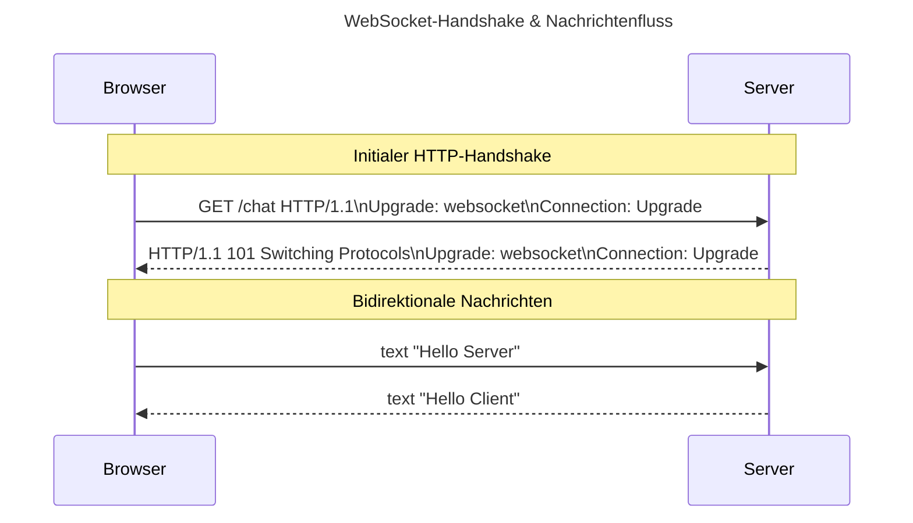

---

### 4.2 Server-Sent Events (SSE): Unidirektionales Streaming

SSE nutzt eine normale HTTP-Verbindung, die der Server offen hält, um fortlaufend Text-Events an den Client zu senden.

* **EventSource API** im Browser: Automatische Wiederverbindung und einfache Handhabung.
* **Format**: Jede Nachricht beginnt mit `data: `, endet mit einem doppelten Zeilenumbruch.
* **Anwendungsfälle**: Live-Benachrichtigungen, Aktienkurse, Log-Streaming.

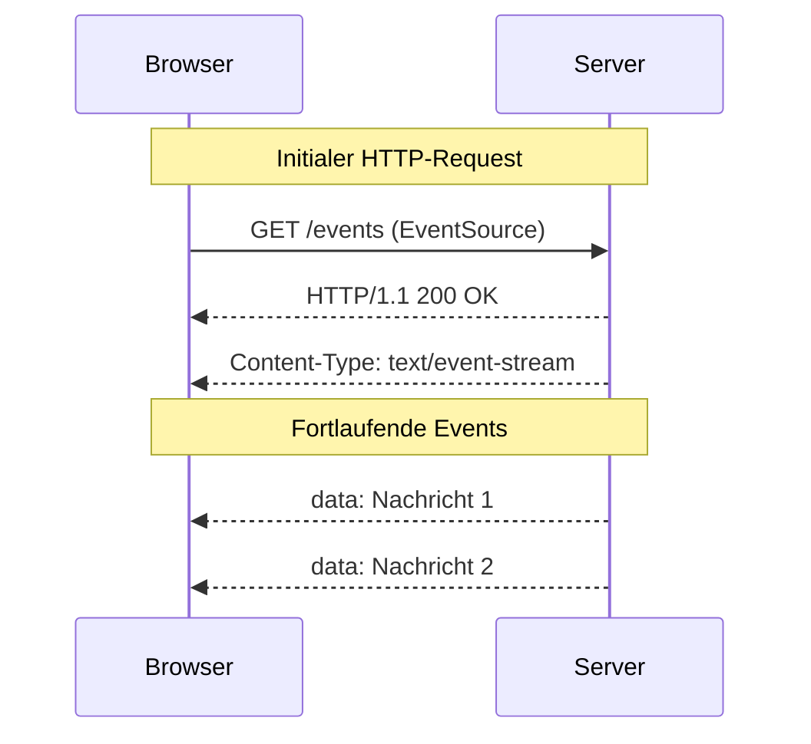

---

### 4.3 Vergleich: WebSockets vs. SSE

| Merkmal         | WebSockets                              | SSE                                             |
| --------------- | --------------------------------------- | ----------------------------------------------- |
| Verbindungstyp  | Bidirektional                           | Unidirektional (Server → Client)                |
| Protokoll       | WebSocket über TCP                      | HTTP/1.1                                        |
| Browser-Support | Alle modernen Browser                   | Alle modernen Browser                           |
| Overhead        | Höher (Handshake + Frames)              | Gering (reines Text-Streaming)                  |
| Skalierbarkeit  | Mehr Ressourcen-Overhead pro Verbindung | Einfachere Skalierung durch normale HTTP-Server |

---

### 4.4 Sicherheit & Authentifizierung

* **TLS**: Absicherung der Verbindung (wichtig bei sensiblen Daten).
* **CORS**: Zugriffssteuerung per Origin-Header.
* **Token-basierte Auth**: JWT oder Session-Cookies in der Initial-Anfrage.


## 5. Content Type

Der `Content-Type`-Header gibt an, in welchem Format der Body der HTTP-Response (oder -Request) vorliegt:

- **Syntax**: `Content-Type: <media-type>; charset=<encoding>`  
  - Beispiel: `Content-Type: text/html; charset=UTF-8`

- **Häufige Media-Types**  
  - `text/html` für HTML-Dokumente  
  - `application/json` für JSON-Daten  
  - `text/css` für Stylesheets  
  - `application/javascript` für JavaScript  
  - `image/png`, `image/jpeg` für Bilder  
  - `application/octet-stream` für beliebige binäre Daten

- **Charset-Angabe**  
  - Wichtig bei Text-Media-Types, um Zeichencodierung eindeutig festzulegen  
  - Beispiel: `Content-Type: application/json; charset=utf-8`

- **Request vs. Response**  
  - Im Request gibt `Content-Type` an, wie der Server den Text im Body interpretieren soll (z. B. bei POST/PUT)  
  - In der Response sagt es dem Client, wie er den empfangenen Body rendern oder parsen muss

- **Content Negotiation**  
  - Clients senden `Accept`-Header, um Medien-Typen zu spezifizieren, die sie verarbeiten können  
  - Server wählt den `Content-Type` entsprechend oder antwortet mit `406 Not Acceptable`, wenn keine Übereinstimmung vorliegt


## 6. Der Webserver

Das HTTP-Protokoll definiert lediglich die Regeln für Anfragen und Antworten zwischen Client und Server. Damit diese Regeln praktisch genutzt werden können, benötigen wir eine Software, die:

1. **Netzwerk-Sockets verwaltet**: Öffnet und hört auf Ports, nimmt eingehende TCP-Verbindungen an und wandelt rohe Byte-Ströme in strukturierte HTTP-Nachrichten um.
2. **Protokoll-Endpunkte implementiert**: Stellt die spezifizierten HTTP-Methoden (GET, POST, etc.) bereit, wertet Header aus und generiert korrekte Statuscodes und Response-Body.
3. **Konfiguration bereitstellt**: Erlaubt das einfache Routing von Anfragen zu unterschiedlichen Hostnamen oder Pfaden über Virtual Hosts und Server-Blocks.
4. **Module und Erweiterungen integriert**: Ergänzt das Grundprotokoll um Funktionen wie SSL/TLS-Verschlüsselung, Gzip-Kompression, Caching-Mechanismen und URL-Rewrite-Regeln.
5. **Leistungs- und Sicherheitsfeatures bietet**: Unterstützt Lastverteilung, Load Balancing, Rate Limiting und Web Application Firewalls für hohe Verfügbarkeit und Schutz gegen Angriffe.
6. **Ecosystem und Support vorhält**: Verfügt über eine aktive Community, Plugins und Integrationen für Logging, Monitoring und Authentifizierung.

### Zusammenfassung

Der Webserver (z. B. Apache oder Nginx) ist die praktische Implementierung des HTTP-Protokolls am Netzwerk-Rand und sorgt dafür, dass standardisierte Anfragen sicher, performant und flexibel verarbeitet werden können.

